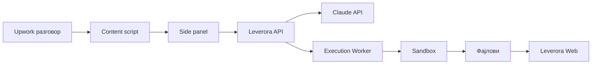
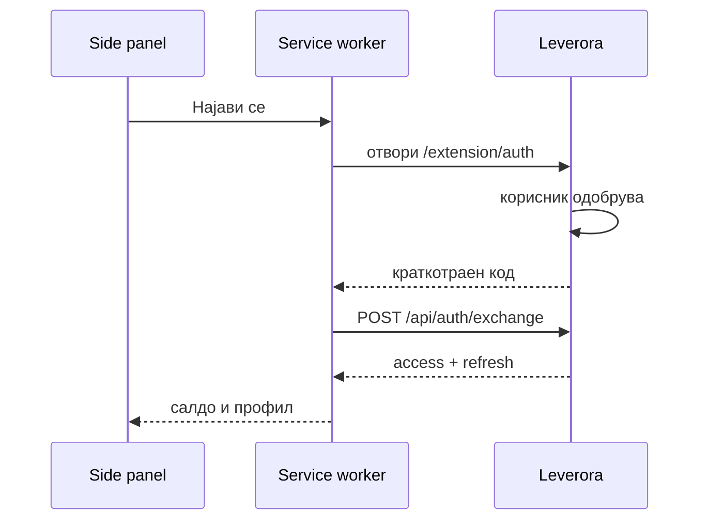

# Leverora Upwork Extension — План за изградба

**Опфат: само екстензијата.** Leverora веб платформата (профил, кредити, наплата преку Creem.io) веќе постои. Овој документ е спецификација за Chrome екстензијата што комуницира со неа. Деловите означени "Leverora страна" се договор — што екстензијата очекува да постои на серверот — не работа за градење овде.

---

## 1. Преглед и архитектура

Екстензијата е тенок клиент: чита разговор на Upwork и прикажува предлог одговори. Целата AI работа, метрирањето на трошок и извршувањето на проекти се на Leverora серверот. Екстензијата никогаш не го повикува Anthropic API директно — клучот би бил извадлив за минути, а кредитите мора да се бројат на место што корисникот не го контролира.

Екстензијата е само за десктоп. Chrome Web Store изречно наведува дека екстензии се користат само на компјутер и не можат да се инсталираат на мобилен уред, дури ни во desktop mode.

| Компонента | Каде живее | Одговорност |
|---|---|---|
| Екстензија (MV3) | Chrome/Edge десктоп | Чита разговор, прикажува предлози, стартува план, води до Leverora |
| Leverora Web (постои) | Vercel | Профил, кредити, Creem.io наплата, преглед планови, преземање проекти |
| Leverora API (постои/се дополнува) | Next.js Route Handlers | Auth, метрирање, повици кон Claude, селектор-конфиг |
| Execution Worker (постои/се дополнува) | Оддел сервис + sandbox | Го гради проектот со Claude Agent SDK |



---

## 2. Технолошки стек (само за екстензијата)

| Дел | Технологија | Причина |
|---|---|---|
| Build | Vite + CRXJS + TypeScript | HMR за MV3, автоматски манифест |
| UI | React 19 + Tailwind v4 | Исти компоненти како на веб |
| Состојба | Zustand + chrome.storage | Service worker-от се гаси кога е idle, меморијата не опстојува |
| Тестирање | Vitest + Puppeteer | Chrome препорачува E2E тестови пред објава |

Важно за MV3: забранет е remotely hosted code. Сета логика во пакетот. Конфигурација како JSON од сервер е дозволена и е во ред; JavaScript од сервер не е.

---

## 3. Структура на репото

```
leverora-extension-upwork/
├─ src/
│  ├─ background/            # service worker: auth токени, повици кон Leverora
│  │  ├─ index.ts
│  │  ├─ auth.ts             # code exchange, refresh ротација
│  │  └─ api-client.ts       # единствено место што знае за токени
│  ├─ content/               # читање на Upwork DOM
│  │  ├─ index.ts
│  │  ├─ thread-detect.ts    # room_id, SPA навигација, хеш
│  │  ├─ reader.ts           # harvest, readFullThread, дедупликација
│  │  ├─ selectors.ts        # конфиг од API + хеуристика + fallback
│  │  └─ injector.ts         # вметнува текст во полето (не праќа)
│  ├─ sidepanel/             # React UI — шесте екрани од дел 4
│  ├─ options/
│  ├─ shared/
│  │  ├─ types.ts            # Thread, Suggestion, PlanRef, Estimate
│  │  └─ tokens.css          # дизајн токени од дел 6
│  └─ manifest.json
├─ tests/                    # Vitest + Puppeteer E2E
└─ vite.config.ts            # CRXJS
```

На Leverora страна веќе постојат (не се градат овде): вебот, базата, Creem.io наплатата, execution worker-от и `/api/*` рутите од дел 5. Ако некој од тие endpoints уште го нема, тоа е единствената серверска работа што мора да се додаде.

Ако подоцна се додаде Fiverr, се создава `apps/extension-fiverr/` со сличен `content/` слој.

---

## 4. Chrome екстензија

UI-то живее во side panel, не во popup. Popup се затвора при секој клик надвор, што е непотребно додека човек пишува порака. Side panel останува отворен при менување табови ако така е поставен, и има пристап до сите Chrome API-ја. Бара Chrome 114+.

### manifest.json

```json
{
  "manifest_version": 3,
  "name": "Leverora for Upwork",
  "version": "0.1.0",
  "minimum_chrome_version": "114",
  "permissions": ["sidePanel", "storage", "activeTab", "scripting"],
  "host_permissions": [
    "https://www.upwork.com/*",
    "https://api.leverora.com/*"
  ],
  "background": { "service_worker": "background/index.js", "type": "module" },
  "side_panel": { "default_path": "sidepanel/index.html" },
  "content_scripts": [{
    "matches": ["https://www.upwork.com/*"],
    "js": ["content/index.js"],
    "run_at": "document_idle"
  }],
  "externally_connectable": { "matches": ["https://leverora.com/*"] },
  "action": { "default_title": "Leverora" }
}
```

Држи ги дозволите на ова ниво. Chrome Web Store бара најава во Privacy таб за секој тип корисночки податок што се собира, и таа мора да се поклопува со privacy policy-то. Секоја вишок дозвола е причина за одбивање.

### Трите компоненти

| Компонента | Одговорност | Не смее |
|---|---|---|
| Service worker | Аут токени, повици кон API, оркестрација | Да држи состојба во меморија — се гаси кога е idle |
| Content script | Чита DOM, скролува, вметнува текст | Да повикува API директно или да ги види токените |
| Side panel | Целиот UI | Да чита DOM директно |

Комуникација: content script ↔ service worker преку `chrome.runtime.connect` (long-lived port, затоа што читањето е стрим); side panel ↔ service worker преку `sendMessage`.

### Екрани во side panel

1. **Ненајавен** — лого, една реченица, копче "Најави се со Leverora"
2. **Нема нишка** — "Отвори разговор со клиент за да почнеш"
3. **Избор на категорија** — 10 картички со икона и една линија опис; памети по нишка
4. **Главен** — хедер (име на клиент · категорија · кредити), предлози, Brief Notes, копче "Направи план"
5. **Нема кредити** — проценката, салдото, копче "Купи кредити" → отвора Leverora
6. **Планот се гради** — прогрес, потоа копче "Отвори на Leverora"

Ширината на panel-от е променлива — UI-то мора да работи од 320px нагоре.

---

## 5. Conversation Reader

Ова е најкршливиот дел од производот и првиот што треба да се изгради. Ако ова не работи стабилно, останатото не вреди.

### Идентитет на нишката

Upwork ги држи разговорите на `/ab/messages/rooms/<room_id>` — тој room ID се појавува дури и во Upwork сопствената OAuth документација како callback URL. Тоа е постабилен идентификатор од било кој DOM селектор.

```
thread_key = sha256("upwork:" + room_id)
```

Името на клиентот се чита од хедерот и се чува **само локално** во `chrome.storage.local`. На серверот оди само хеш. Никогаш не се чува вистинско име на клиент во централната база.

### Повеќе соговорници истовремено

Upwork е SPA — промената на нишка не прави ново вчитување на страната. Затоа детекцијата оди преку два механизма заедно:

1. `chrome.tabs.onUpdated` во service worker-от
2. Hook на `history.pushState` / `popstate` во content script (SPA навигација)

При промена: се затвора стариот контекст, се вчитува записот за новиот `thread_key`, и хедерот се освежува. Корисникот секогаш гледа со кого е и во која категорија.

Запис по нишка (локално + синхронизирано):

```ts
type Thread = {
  threadKey: string;        // hash
  clientName: string;       // САМО локално
  categorySlug: string | null;
  briefNotes: string;
  lastMessageId: string;
  messageCount: number;
  planId: string | null;
}
```

### Скролување и читање

Три режима, секој со своја цена:

| Режим | Кога | Како |
|---|---|---|
| Инкрементален | Постојано | `MutationObserver` на контејнерот; се земаат само нови пораки од `lastMessageId` |
| Целосен | При правење план | Скролува нагоре додека има нова содржина |
| Fallback | Кога селекторите паѓаат | `innerText` на регионот → Haiku 4.5 го структурира во JSON |

Алгоритам за целосно читање:

```ts
async function readFullThread(container: HTMLElement) {
  const collected = new Map<string, Msg>();
  let idleRounds = 0;
  const deadline = Date.now() + 60_000;

  while (idleRounds < 3 && Date.now() < deadline
         && collected.size < 500) {
    const before = collected.size;
    harvest(container, collected);       // собира ВО тек
    container.scrollTop = 0;
    await waitForMutationOr(400);
    harvest(container, collected);
    idleRounds = collected.size === before ? idleRounds + 1 : 0;
  }
  return [...collected.values()].sort(byTimestamp);
}
```

Две замки што мора да се избегнат:

- **Виртуализирани листи.** Upwork ги отстранува пораките од DOM кога се надвор од видното поле. Затоа `harvest()` се вика во тек на скролувањето, не на крајот.
- **Дублирати.** Клуч за дедупликација: `hash(author + timestamp + првите 80 знаци)`.

Над 500 пораки или 60 секунди → прашај го корисникот дали да се читаат само последните N.

### Отпорност на селектори

Не се потпирај на CSS класи — тие се минифицирани и се менуваат при секој deploy. Приоритет:

1. `data-testid` атрибути — најстабилни, Upwork ги користи за сопствените тестови
2. ARIA (`role="log"`, `aria-label`)
3. Структурна хеуристика — најголем scrollable контејнер со повторлива детска структура
4. LLM fallback

Селектор-мапата се повлекува од `GET /api/selectors?platform=upwork`, кеширана 24 часа. Кога Upwork ќе смени нешто, ажурираш ред во база и сите корисници се поправени за 24 часа — без нова Chrome Web Store ревизија, која трае денови. Ова е разликата помеѓу производ што умира и производ што живее.

Додај и телеметрија: `reader_failed` настан со причина → алармира кога стапката надмине 5% за час.

---

## 6. Договор со Leverora (веб + API веќе постои)

Leverora е местото каде се логираат, одобруваат и преземаат плановите и проектите. Тоа е и мобилниот одговор.

### Рути (веб)

| Рута | Што прави |
|---|---|
| `/` | Landing, pricing, регистрација |
| `/app` | Dashboard: салдо, активни нишки, последни проекти |
| `/app/threads/[id]` | Еден клиент: категорија, Brief Notes, историја на планови |
| `/app/plans/[id]` | Планот: читање, верзии, поле за забелешка, Одобри / Смени, PDF |
| `/app/projects/[id]` | Прогрес на извршување, листа фајлови, преземање ZIP |
| `/app/billing` | Пакет, докупување, историја на потрошувачка |
| `/extension/auth` | OAuth шалтер за екстензијата |

### API endpoints што екстензијата ги користи

| Endpoint | Влез | Излез |
|---|---|---|
| `POST /api/auth/exchange` | code | access + refresh токен |
| `POST /api/estimate` | action, должина на контекст | проценети кредити |
| `POST /api/suggest` | пораки, категорија, notes | 2 варијанти + прашања (SSE stream) |
| `POST /api/plan` | цел разговор, notes, додаток | plan_id |
| `POST /api/plan/[id]/revise` | забелешка | нова верзија |
| `POST /api/execute` | plan_id | job_id |
| `GET /api/jobs/[id]/stream` | — | SSE прогрес |
| `GET /api/selectors` | platform | верзиониран JSON |

Секој endpoint што троши кредити го следи истиот редослед: провери салдо → резервирај проценка → изврши → наплати вистинска потрошувачка → ослободи резервација. Без резервација, корисник со 10 кредити може да стартува три паралелни извршувања.

### Auth тек



- `access_token` — 15 минути, само во меморијата на service worker-от
- `refresh_token` — во `chrome.storage.local`, ротира при секоја употреба
- Content script и side panel никогаш не ги гледаат токените

По купување кредити, Leverora праќа порака преку `externally_connectable` → салдото се освежува веднаш, без рестарт.

---

## 7. AI слој — трите фази (Leverora API страна)

Цени на Claude API, Септември 2026, по 1M токени:

| Модел | Влез | Cache read | Излез |
|---|---|---|---|
| Haiku 4.5 | $1 | $0.10 | $5 |
| Sonnet 5 | $2 | $0.20 | $10 |
| Opus 5 | $5 | $0.50 | $25 |

### Фаза 1 — Предлог одговори (Sonnet 5)

```ts
system: [
  { type: "text", text: BASE_RULES },
  { type: "text", text: playbook(category),
    cache_control: { type: "ephemeral" } }
],
messages: [{ role: "user", content: renderThread(last15) + briefNotes }]
```

Излез во строг JSON: `{ direct, with_questions, suggested_questions[], missing_info[] }`. Предлозите се пишуваат во стил на експертот од избраната категорија. Никогаш не се праќаат автоматски — човекот притиска Send.

### Фаза 2 — План (Opus 5)

Влез: цел разговор + Brief Notes + додаток од модалот + целосен playbook + `web_search` ограничен на `sources.json` домените на категоријата.

Излез: структуриран JSON → HTML → PDF (Puppeteer) → storage. Секој план има `version`; ревизијата зема стар план + забелешка и враќа нова верзија.

Структурата е иста за секој план во таа категорија, дефинирана во `plan-template.md`:

1. Разбирање на барањето
2. Скоуп: што влегува / што не
3. Deliverables — точна листа фајлови
4. Пристап по методологијата на експертот
5. Претпоставки и отворени прашања
6. Критериуми за квалитет (Definition of Done)
7. Временска проценка

### Фаза 3 — Извршување (Claude Agent SDK)

Ова не оди преку Messages API. Agent SDK ја има истата агентска јамка, вградени алатки и управување со контекст како Claude Code — Read, Write, Edit, Glob, Grep, Bash, WebFetch, WebSearch — со контрола преку `allowed_tools` и `permission_mode`.

```ts
for await (const msg of query({
  prompt: buildExecutionPrompt(plan, playbook),
  options: {
    model: "claude-opus-5",
    allowedTools: ["Read","Write","Edit","Glob","Grep","Bash","WebSearch"],
    permissionMode: "acceptEdits",
    cwd: sandbox.workdir,
    maxTurns: 40
  }
})) { streamToClient(msg); }
```

Задолжителни огради: hooks што блокираат `rm -rf` и мрежа надвор од whitelist; hard cap на `maxTurns` и токени по job; sandbox се уништува по секое job; стрим на прогрес кон Leverora и side panel преку SSE.

---

## 8. Category Playbook Engine

Секоја категорија е фолдер во `packages/playbooks/`:

```
packages/playbooks/copywriting/
  persona.md          кој е експертот
  canon.md             методологии и фрејмворци (вистински, именувани)
  discovery.md         прашањата за Фаза 1
  reply-style.md       тон, должина, структура на одговорите
  plan-template.md     точна структура на планот
  execution-spec.md    што произведува, во кој формат
  quality-gates.md     чек-листа пред испорака
  sources.json         whitelist домени за web_search
```

### 10-те категории (Upwork)

Критериум: AI мора да ја заврши работата до краен производ, без човечка доработка.

| # | Категорија | Краен производ |
|---|---|---|
| 1 | Copywriting | Sales страници, email секвенци, ad копи |
| 2 | SEO Content Writing | Оптимизирани long-form статии |
| 3 | Web Development | Код: landing pages, bug fixes, конверзии |
| 4 | AI Agent & Chatbot Dev | Код за агент/chatbot + интеграција |
| 5 | Data Analysis & BI | Извештаи, dashboards, Excel анализи |
| 6 | SEO Audit & Strategy | Технички аудит + план за фикси |
| 7 | Translation & Localization | Преведени документи/сајтови |
| 8 | Technical Documentation | API docs, SOP, корисничи упатства |
| 9 | Business Plans & Modeling | Бизнис план + финансиски модел |
| 10 | Legal Document Drafting | Нацрт договори, NDA, ToS, Privacy Policy |

Категорија 10 секогаш излегува со ознака "нацрт — не е правен совет".

### Целосен пример: Copywriting

**persona.md**

> Си senior direct-response copywriter со 15 години во performance маркетинг. Работиш по мерливи резултати, не по "убав текст".

**canon.md** — вистински, проверливи фрејмворци:

- **Eugene Schwartz, Breakthrough Advertising** — пет степени на свесност. Секој headline се мапира на еден од нив.
- **Alex Hormozi, $100M Offers** — Value Equation.
- **Joanna Wiebe / Copyhackers** — message mining.
- **David Ogilvy** — headline е мнозинство од вредноста.
- **PAS / AIDA / 4Ps** — структурни скелети.

**discovery.md**

1. Кој точно го купува ова?
2. Која е трансформацијата — од каде до каде?
3. Колкава е моменталната конверзија и каде се губат?
4. Кој е главниот приговор поради кој НЕ купуваат?
5. Има ли постоечко копи што работело?
6. Каде се чита — cold traffic, email листа, retargeting?

**quality-gates.md**

- [ ] Headline мапиран на конкретен степен на свесност
- [ ] Најмалку 3 конкретни бројки или докази, нула празни суперлативи
- [ ] Еден CTA, повторен според должината
- [ ] Приговорите адресирани експлицитно
- [ ] Нема ниту еден збор што не служи на продажбата

**sources.json**: `["copyhackers.com", "acquisition.com", "nngroup.com", "cxl.com"]`

Секоја категорија е околу два дена работа ако се прави сериозно. Тоа е 20 дена што не смеат да се скратат.

---

## 9. Дизајн систем

Темен со зелена. Една датотека, споделена концептуално со веб (ако Leverora веб ги користи истите токени, добро е да се остане усогласено):

```css
:root {
  --bg-base:      #0B0F0D;
  --bg-surface:   #131A16;
  --bg-elevated:  #1B2620;
  --border:       #253029;
  --text-primary: #E8F0EA;
  --text-muted:   #8A9A90;
  --accent:       #22C55E;
  --accent-hover: #16A34A;
  --accent-dim:   rgba(34,197,94,0.10);
  --warning:      #F59E0B;
  --danger:       #EF4444;
  --radius-card:  10px;
  --radius-btn:   8px;
}
```

| Елемент | Правило |
|---|---|
| Типографија | Inter за UI, JetBrains Mono за кредити и код |
| Side panel | Работи од 320px нагоре |
| Акцентна боја | Само за една примарна акција по екран |
| Кредити | Секогаш видливи во хедерот, монospace фонт |
| Состојби | Секој екран има loading, empty, error варијанта |

---

## 10. Билинг (веќе на Leverora — контекст за екстензијата)

Пакетите се сликаат по Claude паковки, само што кредитите се трошат побрзо — маркапот е 10× над реалниот трошок.

### Трошок по акција

| Акција | Модел | Реален трошок | Цена (×10) | Кредити |
|---|---|---|---|---|
| Предлог одговор | Sonnet 5 | ~$0.013 | $0.13 | 13 |
| План | Opus 5 | ~$0.14 | $1.40 | 140 |
| Ревизија на план | Opus 5 | ~$0.16 | $1.60 | 160 |
| Извршување (мал) | Opus 5 | ~$0.95 | $9.50 | 950 |
| Извршување (среден) | Opus 5 | ~$2.00 | $20 | 2,000 |

### Пакети

| План | Цена | Кредити/мес | Во пракса |
|---|---|---|---|
| Free | $0 | 700 еднаш | ~50 предлог одговори; недоволно за проект |
| Pro | $20/мес | 2,000 | 1 среден проект ИЛИ ~150 одговори |
| Max 5× | $100/мес | 11,000 | 5 проекти + одговори |
| Max 20× | $200/мес | 24,000 | Секојдневна работа, агенциско користење |
| Top-up | $10 / $50 | 900 / 5,000 | Докупување било кога |

### Три последици за UI

1. Секое копче што троши кредити ја покажува цената пред клик: "Направи план · ≈140 кредити". Без изненадувања.
2. Извршувањето е најголемиот трошок — бара потврда со прикажана проценка, не се стартува со еден клик.
3. Кога салдото паѓа под цената на едно извршување, хедерот станува жолт — предупредување пред да застане на половина.

Маркапот и бројот кредити по пакет се конфигурација, не константи расфрлани низ кодот — ќе се менуваат по првите 100 проекти.

---

## 11. Безбедност, ToS и Chrome Web Store

### Upwork ToS — чесен поглед

Upwork нема јавен или self-serve пристап до пораки преку API. Messaging endpoints постојат само во партнерскиот API за enterprise одобрување, и нема OAuth scope што индивидуален freelancer или независна апликација може да го побара. Затоа читањето оди преку DOM во browser-от на корисникот.

Што го намалува ризикот:

- Никогаш не се праќа порака автоматски — човекот притиска Send
- Нема масовни акции, нема scraping на туѓи профили, нема позадинско читање без отворен таб
- Содржината на пораките не се чува подолго од потребното за повикот
- Име на клиентот никогаш не оди на сервер

Што мора да стои во Terms на Leverora: читањето пораки надвор од одобрената партнерска програма носи ризик за корисничкиот профил. Не вели "нема ризик" — тоа е и нетточно и правно опасно.

### Chrome Web Store

- **Забранет remotely hosted code.** Сета логика во пакетот. Селектор-JSON е податок и е во ред; JavaScript од сервер не е.
- **Privacy таб.** Задолжителна најава што се собира и како се рангува; мора да се поклопува со објавената privacy policy.
- **Single purpose.** Опишето како една работа: помош во комуникација со клиенти на Upwork.
- **Минимални дозволи.** Секоја вишок е причина за одбивање.
- **E2E тестови.** Chrome препорачува Puppeteer за проверка на целиот тек пред објава.

Поднеси го во Store во Фаза 7, не на крај — ревизијата може да врати барања што траат недела.

### Други ризици

| Ризик | Митигација |
|---|---|
| DOM се менува | Remote селектор-конфиг + LLM fallback + алармирање |
| Трошок ескалира | Hard cap по job, circuit breaker, проценка пред старт |
| Квалитет на испорака | Quality gates + задолжителен преглед пред преземање |
| API клуч истекувa | Клучот е само на сервер, никогаш во екстензија |

---

## 12. Roadmap

Правило: Фаза 1 е прва затоа што е најризична. Ако читањето на разговор не работи стабилно, останатото не вреди.

| Фаза | Недели | Што се гради | Готово кога |
|---|---|---|---|
| 0 — Основа | 1 | Скеле на екстензијата, дизајн токени, auth тек кон Leverora | Екстензијата се најавува со Leverora профил |
| 1 — Читање | 2 | Content script, reader, нишка, side panel skeleton | Разговорот се чита точно |
| 2 — Предлози | 1.5 | `/api/suggest`, 1 категорија, вметнување | Прв корисен одговор |
| 3 — Кредити | 1 | Метрирање, проценки, банер за кредити | Може да се наплати |
| 4 — План | 2 | `/api/plan`, PDF, ревизии, `/app/plans` | План со циклус на измени |
| 5 — Извршување | 3 | Agent SDK worker, sandbox, ZIP, SSE | Прв испорачан проект |
| 6 — Playbooks | 3 | Сите 10 категории напишани и тестирани | Производот е комплетен |
| 7 — Chrome Web Store | 1.5 | Privacy policy, Store ревизија, полирање | Јавно достапно |
| 8 — Fiverr | 2 | Втора екстензија | Два производа |

Вкупно околу 17 недели секвенцијално.

### Што прво да се кодира во Фаза 1

- [ ] `manifest.json` со точните дозволи од дел 4
- [ ] Content script што го чита room_id од URL и го хешира
- [ ] SPA навигација hook (`pushState` + `popstate`)
- [ ] `harvest()` со дедупликација по hash
- [ ] `readFullThread()` со лимити
- [ ] Селектор-конфиг од API со 24h кеш
- [ ] Side panel што го прикажува прочитаниот разговор како листа
- [ ] `reader_failed` телеметрија

Кога овие осум работат на пет различни вистински разговори, продолжи на Фаза 2.

---

## 13. Отворени одлуки

1. **Sandbox провајдер** — E2B, Daytona или сопствени Fly Machines (Leverora страна, не блокира екстензијата).
2. **Дали категорија пред предлози?** — дали Фаза 1 работи без избрана категорија, или мора прво избор.
3. **Retencija на фајлови** — колку долго стојат готовите проекти на Leverora пред бришење (влијае на трошокот за storage, не на екстензијата).

### Извори

- Claude API pricing, Септември 2026
- Upwork API пристап до пораки, 2026
- Chrome Side Panel API — developer.chrome.com/docs/extensions/reference/sidePanel
- Chrome Web Store best practices — developer.chrome.com/docs/webstore/best-practices
- Claude Agent SDK — code.claude.com/docs/en/agent-sdk
- Prompt caching — platform.claude.com/docs/en/build-with-claude/prompt-caching
